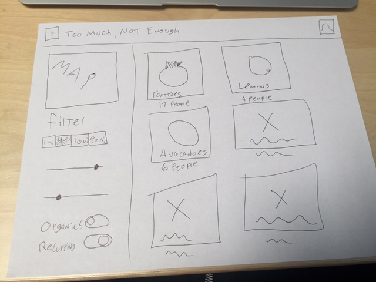

# Too Much, Not Enough

We have 24 hours before our big pitch meeting with 5,000,000 Startups. They're really excited about our idea, but they want to see a few examples of the front-end. They're not too focused on user experience, it's more that I think they don't understand the problem we're trying to solve. So let's throw together some HTML so they know we have a crack team of developers who can iterate quickly. Oh also I already promised we'd have it so it's too late to back out now.

To recap, our idea is to disrupt the sharing economy for hyper-local food production.  

What do you mean, can you elaborate? Fine.  

People have gardens, sometimes they produce too much of one kind of food and not enough of others. We want to let people share what they overproduce, and get things they don't have from others who overproduced different things.  

A user story? I guess I could make one up if you really need one.  

#### User Stories
Carol has a garden, in which she grows tomatoes and zucchini. She also has a lemon tree. She always has a million lemons and tomatoes, but she goes through zucchini super fast. She also doesn't have an herb garden.
Mark has chickens who lay too many eggs, and too much zucchini. He wants lemons and tomatoes. Sally has an herb garden and squash. She also wants tomatoes, and eggs.  

We just want these people to be able to coordinate. Carol should be able to note she has a lot of tomatoes and lemons, Mark should be able to tell people he has eggs and zucchini, Sally should be able to offload some of her giant rosemary bushes.  

If Sally wants to go looking for eggs, she should be able to look for eggs, see users near her who have too many, and see what they want in return. If she has that, she can set up a trade.  

#### What we need
We don't have to create the whole user flow, just create an example layout for a few screens.  

We should have a screen that shows what users near you have a surplus of. It should list the items people have surpluses of in a grid, with a map view of the actual locations (just throw up a map of sf). I sketched this wireframe out:

Show a search results page for... let's say tomatoes. It should show all the users who have a surplus of tomatoes, with a bio, a list of what they have, and a list of what they need. Here's another sketch:

We haven't figured out the trade screen, so just start with these. Should be enough for our pitch meeting.